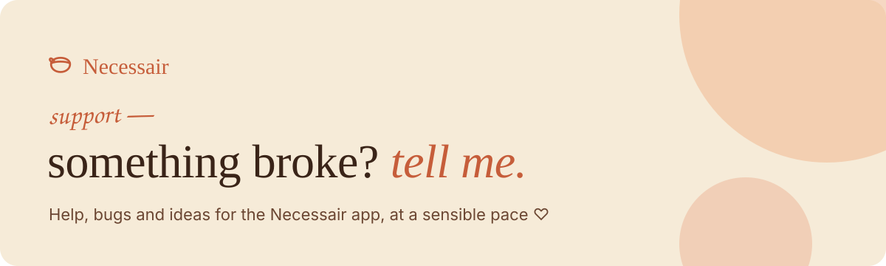
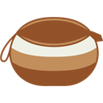

<picture>
  <source media="(prefers-color-scheme: dark)" srcset="assets/banner-dark.svg">
  
</picture>

**Necessair** is a quiet place to keep what you find: a link, a passage from
an article, a paragraph from a PDF. No account, no server, and it syncs only
if you ask it to, through your own Google Drive.

 

This is its support corner. The same help lives on the site, with a little
form that fills in a ticket for you:
**<https://caroljardims.com.br/content-saver/support>**

## Two ways to reach me

**Tickets on GitHub.** Bugs, ideas and requests live here, in the open. You
can also read what others already reported.
[Open a ticket →](https://github.com/caroljardims/necessair-support/issues/new) ·
[see open tickets →](https://github.com/caroljardims/necessair-support/issues)

**Email.** Prefer something quieter, or don't have a GitHub account? Write to
me directly at [caroljardims@gmail.com](mailto:caroljardims@gmail.com?subject=Necessair).
I usually reply within a few days.

Tickets here are public, so please keep your library to yourself: describe
what you saved ("a long selection from a PDF") instead of pasting it. Tell me
the browser and its version, or your macOS version, and the steps that led
there. Two or three lines are usually all it takes.

## Before you write — three things that solve most of it

<strong>My captures disappeared</strong>

Captures live in your browser's local storage. Clearing site data, using a
fresh profile, or reinstalling the extension wipes that copy. If you had
connected Google Drive, reconnect the same account and they come back.

<strong>Saving does nothing on a certain site</strong>

Some pages block extensions entirely (the browser's own pages, the Web Store,
some PDFs), and some load the article only after you scroll. Try selecting the
text and using the right-click menu instead — and tell me which site it was.

<strong>Drive sync stopped</strong>

The access token expires, and revoking access in your Google account ends it
too. Disconnect and reconnect Drive in the extension. Your local copies are
untouched either way.

What Necessair keeps, and where, is all in the
[privacy policy](https://caroljardims.com.br/content-saver/privacy). The app's
source code is not public; this repository holds only this page and your
tickets.

## A small favor

Support is free and stays free — a coffee just makes the answers arrive
caffeinated. [Pix (Brazil)](https://caroljardims.com.br/pix) ·
[Buy me a coffee](https://buymeacoffee.com/caroljardims)

(no pressure though — a kind note is also a very acceptable currency ♡)

## Em português

Este é o cantinho de suporte do Necessair. O mesmo suporte está no site, com
um formulário que já preenche o chamado pra você:
<https://caroljardims.com.br/content-saver/support>. Se algo deu errado ou
você teve uma ideia, [abra um chamado](https://github.com/caroljardims/necessair-support/issues/new),
em português mesmo, ou escreva para
[caroljardims@gmail.com](mailto:caroljardims@gmail.com?subject=Necessair). Só
não cole aqui o que você guardou: os chamados são públicos, e os seus trechos
são seus.

---

made with care, at a sensible pace ♡
